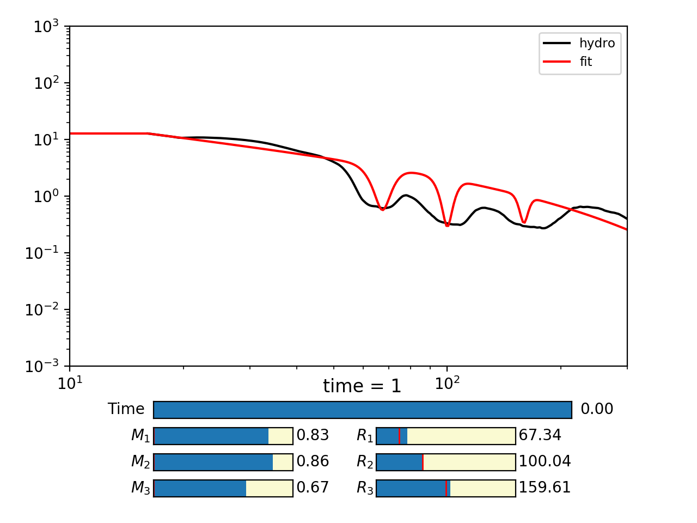

# Results widget

Reads data from `data.csv` and displays it along with a reference curve.
Parameters can be selected and the lines update automatically. Clicking on a line
prints the parameters on the screen.

Just run `python results_widget.py` from the terminal or from `ipython`, run `%run results_widget.py` to call the plot. Modify it to your needs.

